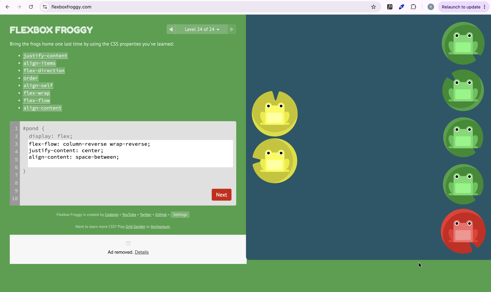

After the long and tedious stuff of [theme toggle](/blog/building-this-blog-theme-toggle/), I have turned to the simpler stuff: the font and the footer. So this is a short one for me to remember basics.

## Swapping the font

I learnt that Astro has a built-in font API, so I don't hand-write `@font-face` rules or drop `<link>` tags in the head. I just describe the font I want in `astro.config.mjs` and Astro handles the rest. This is how I do it:

```js
// astro.config.mjs
import { defineConfig, fontProviders } from 'astro/config';

export default defineConfig({
	fonts: [
		{
			provider: fontProviders.google(),
			name: 'Manrope',
			cssVariable: '--font-manrope',
			weights: [400, 600, 700],
			fallbacks: ['sans-serif'],
		},
	],
});
```

I set the `cssVariable` on `body` in `global.css`, and everything inherits it e.g:

```css
body {
	font-family: var(--font-manrope);
}
```

Fun fact that I found out in a not so fun way: **if you don't list `weights`, Astro only loads `[400]`. So you gotta list out all the font weights you want.


## Footer work

I wanted the copyright on the left and the social icons on the right, sitting on the same line. I remembered that I have strayed far from my former flexbox glory, what with all the Wordpress Learndash drag-and-drop I have done over the past few years.

Had to dust off the coat, and be serious about my life again...so I played...[Flexbox Froggy](https://flexboxfroggy.com/)!



## Importing icons with astro-icon

I downloaded some SVGs and wanted to use them without pasting giant `<svg>` blobs into my markup. The clean way in Astro is the **astro-icon** integration.

You gotta npm install it `npm install astro-icon` , then add it to the config:

```js
// astro.config.mjs
import icon from 'astro-icon';

integrations: [mdx(), sitemap(), icon()],
```

astro-icon reads local SVGs from **`src/icons/`** by default, and the filename becomes the icon's name:

```text
src/icons/
├── email.svg
├── linkedin.svg
└── github.svg
```

Then I drop them in wherever, by name:

```astro
---
import { Icon } from 'astro-icon/components';
---

<a href="mailto:ruvarashe.sadya@gmail.com" aria-label="Email">
	<Icon name="email" />
</a>
<a href="https://github.com/ruvas20" target="_blank" rel="noopener" aria-label="GitHub">
	<Icon name="github" />
</a>
```

Forward ever!
