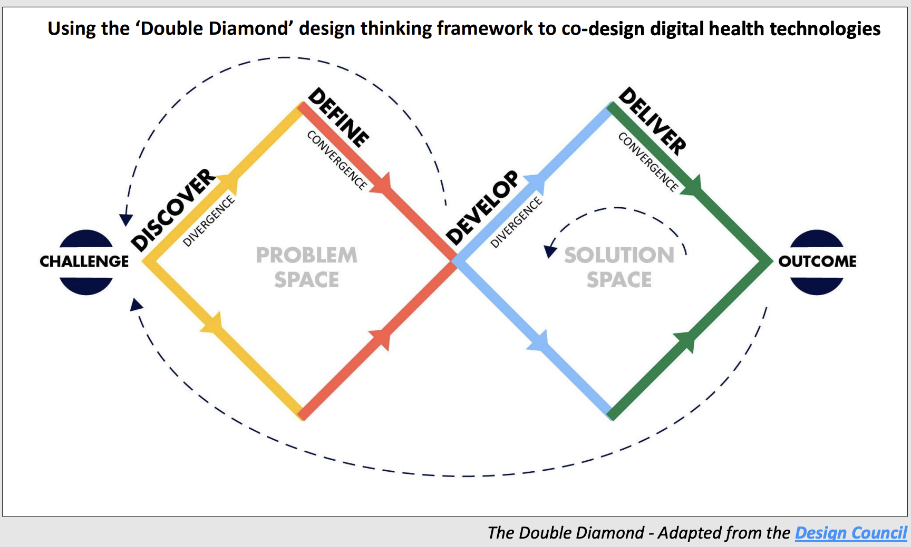

Oh yes, back at it again with *Co-design for Digital Health*. Today I learnt about the Double Diamond framework - a design thinking framework built around two diamonds and four phases. You widen out to explore, narrow down to decide, and then do it again. I did learn this in an Entrepreneurship Course I took once upon a time, but I was learning for grades, really. Now we learn for life.

## Discover

The goal here is to identify a challenge worth solving and then understand it properly, in all its contexts, by speaking to and spending time with the people affected by it.

The primary risk is that people will tell you what they want rather than what they need, or what they think you want them to want. Sometimes they will describe something they have become so habituated to that I no longer registers as a problem worth mentioning. (I like that word, *habituated*.)

## Define

This is where you analyse what you gathered and filter the insights, with the aim of defining the challenge, often differently from how you first framed it. That becomes your starting point when you move into solution finding.

## Develop

Now you explore and co-create a range of potential solutions with end users and stakeholders, and prioritise the options that are feasible and useful enough to take forward for testing.

## Deliver

Test different solutions at small scale, evaluate them, reject the ones that won't work, and improve the ones that will. Gradually you arrive at one final product or service, and you implement it.

## It is non-linear

Following it strictly would be strange, and may err on lacking empathy. You can never just say "I'm done hearing from these sick people" and then just go onwards and never come back to them. 

The gist of the whole thing is:

1. Put people first. Understand them as best you can.
2. Communicate visually and inclusively so people can understand what the heck you're doing.
3. Collaborate and co-create. Work together, get inspired by what others are doing.
4. Iterate. It helps you spot errors early, avoid risk, and build some confidence in your ideas.

Honestly, just very solid life advice overall.

Obviously, every framework attempts at generalising the world. It's just an effort at explaining what the ideal way of thinking is. None of them tells you in detail what should be done when the inevitable unexpected comes around. I'm going to philosophise for a bit here and say that you inevitably begin with beliefs inherited from somewhere and they do have some merits. The important thing is that beliefs should be exposed to challenge rather than accepted merely because they were inherited.

Sometimes you start from scratch. Sometimes you build on green field. There is no one size fits all. But it's nice to have a reference point.

## On Designing inclusively and ethically

The five principles the course gave for inclusive design:

- Places people at the heart of the design process
- Acknowledges diversity and difference
- Offers choice where a single design solution cannot accommodate all end users
- Provides for flexibility
- Provides buildings and environments that are convenient and enjoyable for everyone to use

Anything involving real people brings its own set of obligations:

- Respect for the rights and dignity of individuals and groups
- Participants' privacy and anonymity
- Informed consent
- Data security
- Confidentiality
- Integrity of data

It isn't always necessary to capture one specific individual's experience, so it's worth checking your ethical considerations before you go looking for it.

## The King's Model

The course used the King's Model as an example of recruiting participants from a wider range of backgrounds. It splits into work inside the institution and work outside it.

| Inside the hospital | Out in the community, in schools, colleges, youth centres, churches and similar |
| --- | --- |
| Attending senior management meetings to raise the issue and keep the dialogue going | Identifying local champions |
| Attending smaller departmental meetings to educate staff and hear their views | Hosting seminars and workshops, online or in person, to address misconceptions and raise awareness |
| Organising meetings on diverse recruitment strategies with professionals who have a track record on it | Attending awareness days, the way key staff ran stalls to drive COVID-19 vaccine trial recruitment |
| Creating electronic resources that drive research participation within the hospital | Sharing videos featuring patient ambassadors from ethnic minority backgrounds, distributed through social media |

And when you get to writing the actual recruitment materials, they should cover:

- A visual, plus a heading or question that catches attention
- Who you are and what the project is about
- Who you're looking for, and the eligibility criteria
- What taking part involves, including location, date and time commitment
- Any financial compensation, and other incentives such as the chance to learn more about a health condition or to improve care
- A link, address or phone number for more information, ideally with the offer of an informal chat
- How to register interest

Suprisingly, I think these are really effective health posters. Much better than fancy Canva Designs, but I wonder if they would work with the more digitally invested demographic. Not sure if I can link em here without violating some data laws, but esssentially they have that tv hook "Are you or anyone you know suffering from Mesothelioma?"

## Where this leaves me

The framework won't do the hard part for me, which is still sitting with people long enough to hear what they actually mean.

For now, I'm going to keep reading, and keep reminding myself that people are not the problem, people are the point.