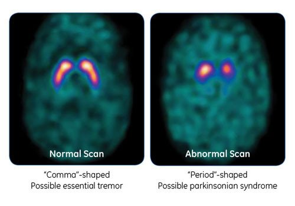
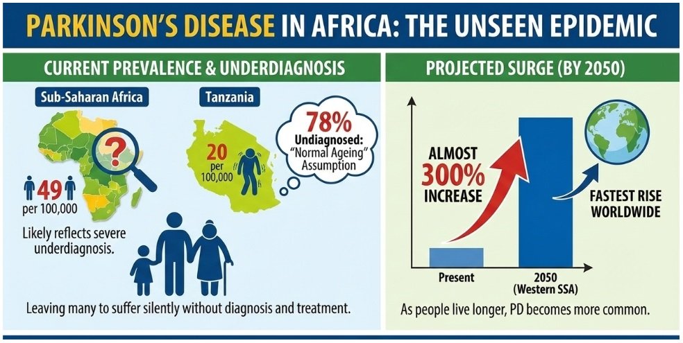

# What's DAT?

I entered the DaT Parkinson's Challenge on DrivenData a couple weeks ago. It's a 3D computer vision competition built on dopamine transporter brain scans called DaTscans, and I signed up just for funsies as I've never done a computer vision competition like this before. So, I committed to spending weeks working on a medical imaging problem for a disease I couldn't have described to you in a single sentence.

So here I am with the rundown of what I've learnt so far.

## First, very briefly, the disease

Parkinson's is a neurodegenerative condition caused by the loss of dopamine-producing neurons in a region of the brain called the substantia nigra, which costs you control over voluntary movement (Magesh et al., 2020). Diagnosis is clinical, meaning a neurologist watches you, examines you, takes a history, and decides. There is no blood test. A definitive diagnosis technically requires examining the brain after death, and pathology confirms only about 80% of clinical diagnoses (Hughes et al., 1992, as cited in Seifert & Wiener, 2013). Around two in ten patients are initially misdiagnosed, even at experienced centres (Isaacson et al., 2021).

That is the why the scan exists.

## What the scan is

A DaTscan is the closest thing to a picture of the problem. You're injected with a radioactive tracer called Ioflupane I 123, which binds to the dopamine transporter (DAT), and a few hours later a SPECT scanner picks up the radiation coming from inside your head. Pretty cool stuff, if you ask me. What it produces is a map of how much transporter is available in the striatum, and less transporter activity implies less dopamine (Davis Phinney Foundation, 2023).

The pattern is the readable part. Gilbert (2024) and the Davis Phinney Foundation (2023) both describe it the same way: in someone without Parkinson's, activity appears evenly on both sides and reads like two commas, while in someone with Parkinson's one side often collapses toward something closer to a period, because the loss tends to be asymmetric.

*Image from Gilbert (2024), American Parkinson Disease Association.*

## What the scan can't do

The scan doesn't do what I assumed it does. Gilbert (2024) lays out three things that surprised me about what it can and can't do:

- **It can't tell Parkinson's apart from its lookalikes.** Progressive Supranuclear Palsy, Multiple System Atrophy and Corticobasal Degeneration all come back abnormal too. What it's actually approved for is narrower: separating Parkinson's from essential tremor, which involves no dopamine loss and gives a normal scan.
- **It can't tell you how far along someone is**, only whether the dopamine system is impaired at all, so it isn't repeated to track progression.
- **Once motor symptoms appear, it performs about as well as a careful clinical exam**, since a neurologist is already picking up things like a reduced blink rate or handwriting that shrinks as it goes.

However, it appears that it still has its merits in resolving a specific kind of uncertainty: is dopaminergic degeneration present at all, in a patient where the exam won't settle it.

Read that way, the numbers get more interesting. Isaacson et al.\* (2021) followed 201 patients whose specialist ordered a scan for exactly that reason:

- The diagnosis changed in 39.8% of them
- Medication changed for 70.1%
- Even among patients rated 90% likely to have Parkinson's, 20% came back normal

An earlier survey found the diagnosis changed in 31% of cases, but physicians said the scan influenced their thinking in 68%, so much of its value was confirming what they already suspected (Seifert & Wiener, 2013). Put together, the scan clearly isn't diagnostically better than a good clinician but still changes what that clinician does, because being confident and being correct aren't the same thing.

\**Worth noting that the Isaacson study was funded by an unrestricted grant from the company that makes the scan, so that one's kinda suss.*

## Training models on DaT

What I realised is quite often, we are training models on scans of patients who are already symptomatic, and asking them a question the scan itself can't fully answer.

When a dataset says "PD" next to a scan, that label is a clinician's judgment, not ground truth. A model can only ever learn to agree with the doctors who labelled the data, including where they were wrong.

That's the smaller problem. The bigger one is what the scan itself can't see. The hard clinical question is Parkinson's versus the atypical parkinsonisms, and an abnormal scan looks the same either way, so no dataset built on these images can teach a model to make that call.

Which leaves the question of what a very accurate model is actually worth here. A model that separates symptomatic Parkinson's scans from healthy controls might be learning real patterns, and I'm not claiming it's just parroting the neurologist. But it's solving a problem that gets less valuable the more clinical information is already available, and by the time someone has a DaTscan they've usually got plenty. The obvious place for AI to add something is earlier, in the ambiguous cases, before the exam is conclusive.

So how much of the training data actually looks like that? Not much. Shokrpour et al. (2025) reviewed 133 machine learning papers on Parkinson's diagnosis published between 2021 and April 2024 and found only around 20% specifically targeted early-stage detection.

I'll also admit I'm not sure how much earlier detection would help right now. If you're symptomatic you'll eventually get referred and diagnosed anyway, and there seems to be little to do to prevent PD. Gilbert (2024) describes researchers working toward diagnosing Parkinson's before motor symptoms appear, using biomarkers rather than clinical signs, with the payoff being earlier clinical trial enrolment and, if disease-slowing drugs are ever developed, earlier treatment. 

Which brings me back to what a good accuracy number is actually evidence of. Magesh et al. (2020) is one paper that caught my interest on that question. They used a technique called LIME, which probes a model by feeding it altered versions of an image and watching what changes the answer, then highlights the regions that mattered (Ribeiro et al., 2016). On a DaTscan, the highlighting lands on the putamen and caudate, the two structures making up the striatum, which is the comma-and-period region from earlier and exactly where the dopamine loss shows up (Magesh et al., 2020). Their accuracy figure sits in the middle of the pack against the earlier studies they compare themselves to, but the number isn't the point. Showing the model is reading the same part of the brain a neurologist would is a stronger claim than beating a benchmark. I hope to try and apply that framework to my own work.

## What's DAT in Africa?

At this point I put on my public-health goggles. The DaTscans in Magesh et al. (2020) come from the Parkinson's Progression Markers Initiative, running in Europe, the United States, Australia and Israel. Everyone in that dataset already reached a specialist who ordered a specialised scan, which means the population has been filtered by access before a single image was taken. 

If this field is being built on data from wealthy healthcare systems, what do we actually know about Parkinson's in Africa?

Less than I expected. Williams et al. (2018) reviewed everything published on idiopathic Parkinson's in Sub-Saharan Africa up to May 2016 and reported that dopamine transporter imaging was unavailable in all settings studied (Dotchin & Walker, 2012, as cited in Williams et al., 2018). Dekker et al. (2020) found the same across Tanzania, Nigeria, Mali and South Africa, apart from six PET scanners in South Africa. So the scan this entire subfield is built around does not exist across most of a continent.

The prevalence numbers also look low. Williams et al. (2018) report a range from 7 per 100,000 in Ethiopia to 67 per 100,000 in Nigeria, with the most rigorous door-to-door study giving an age-adjusted 40 per 100,000 in Tanzania, well under European figures. Then I thought, is Parkinson's less common here, or are we just bad at finding it?

*Image from Samuel (2026), DatelineHealth Africa. Note that Samuel cites different figures, putting Sub-Saharan Africa at 49 per 100,000 and Tanzania at 20 rather than 40.*

**There are good reasons to think we're undercounting.** Sub-Saharan Africa has 0.03 neurologists per 100,000 people against 4.84 in Europe, symptoms get read as normal ageing, the population is younger, and survival is shorter without treatment, since Parkinson's medications are available in about 12.5% of African countries against 79.1% of European ones (WHO, 2004, as cited in Williams et al., 2018). Any of those would push a measured prevalence down.

**But there are also reasons to wonder whether the biology differs**. Mutations in the established Parkinson's genes were largely absent from the indigenous Black African cohorts studied, with Parkin the only confirmed exception, in South African and Zambian patients (Williams et al., 2018). Dekker et al. (2020) note that the LRRK2 G2019S mutation is common in North African Arab populations and hasn't been identified in anyone of Black African ancestry studied so far.

I can't settle it either way, I don't know much about anything fr. The studies are also small and the prevalence estimates use different populations and methods, so maybe someday we'll find out.

## Where this leaves me

I've learnt a lot about what the scans actually capture, who they represent, and whether that carries over to the healthcare settings I care about. I don’t know that the model I am training will transfer here. I just don’t think we know enough about the population to assume it will.

I’m still doing the competition to build my medical imaging skills.

In the meantime, I really really can't do this all on my own (I'm no Superman).

No like fr. It's a lot of work and the yt videos are mid.

---

## References

Davis Phinney Foundation. (2023, March 6). *DaTscan: What it is, how it works, and what it can tell you*. https://davisphinneyfoundation.org/blog/datscan/

Dekker, M. C. J., Coulibaly, T., Bardien, S., Ross, O. A., Carr, J., & Komolafe, M. (2020). Parkinson's disease research on the African continent: Obstacles and opportunities. *Frontiers in Neurology, 11*, 512. https://doi.org/10.3389/fneur.2020.00512

Gilbert, R. (2024, July 30). *What is a DaTscan and should I get one?* American Parkinson Disease Association. https://www.apdaparkinson.org/article/what-is-a-datscan-and-should-i-get-one/

Isaacson, J. R., Brillman, S., Chhabria, N., & Isaacson, S. H. (2021). Impact of DaTscan imaging on clinical decision making in clinically uncertain Parkinson's disease. *Journal of Parkinson's Disease, 11*(2), 885–889. https://doi.org/10.3233/JPD-202506

Magesh, P. R., Myloth, R. D., & Tom, R. J. (2020). An explainable machine learning model for early detection of Parkinson's disease using LIME on DaTSCAN imagery. *Computers in Biology and Medicine, 126*, 104041. https://doi.org/10.1016/j.compbiomed.2020.104041

Samuel, O. (2026, January 19). *Parkinson's disease explained for Africans: Symptoms and treatment* (A. Odutola, Med. Rev.). DatelineHealth Africa. https://www.datelinehealthafrica.org/parkinson-s-disease-explained-for-africans-symptoms-and-treatment

Seifert, K. D., & Wiener, J. I. (2013). The impact of DaTscan on the diagnosis and management of movement disorders: A retrospective study. *American Journal of Neurodegenerative Disease, 2*(1), 29–34.

Shokrpour, S., MoghadamFarid, A., Bazzaz Abkenar, S., Haghi Kashani, M., Akbari, M., & Sarvizadeh, M. (2025). Machine learning for Parkinson's disease: A comprehensive review of datasets, algorithms, and challenges. *npj Parkinson's Disease, 11*(1), 187. https://doi.org/10.1038/s41531-025-01025-9

Williams, U., Bandmann, O., & Walker, R. (2018). Parkinson's disease in Sub-Saharan Africa: A review of epidemiology, genetics and access to care. *Journal of Movement Disorders, 11*(2), 53–64. https://doi.org/10.14802/jmd.17028